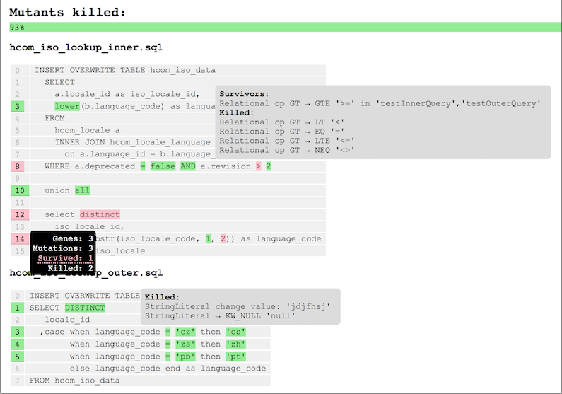

    

# Overview
Mutant Swarm is a mutation testing framework for Hive SQL built on top of [HiveRunner](https://github.com/klarna/HiveRunner).
It enables the identification of areas of SQL code bases that have poor test coverage and consequently may be a source
of operational risk.

# Usage
You can enable Mutant Swarm on your HiveRunner test suites like so:
1. Add `mutant-swarm` dependency
2. Replace JUnit runner or extension implementation
3. Execute test suite
4. Locate and view report

## Dependency
    <dependency>
      <groupId>com.hotels</groupId>
      <artifactId>mutant-swarm</artifactId>
      <version>1.0.0</version>   
      <scope>test</scope>
    </dependency>

## JUnit4
HiveRunner JUnit4 tests suites use the `com.klarna.hiverunner.StandaloneHiveRunner` JUnit4 runner implementation. To enable the
Mutant Swarm runner you simply need to replace this with the `com.hotels.mutantswarm.MutantSwarmRunner` implementation:

    @RunWith(MutantSwarmRunner.class)
    public class HiveSqlEtlTest {
      ...
    @Test
      ...
    }

## JUnit5
To use JUnit5 and the extension model, you will need to have at least the version 1.1.0 of Mutant Swarm.

HiveRunner JUnit5 tests classes use the `com.klarna.hiverunner.HiveRunnerExtension` JUnit5 extension implementation. To enable the
Mutant Swarm extension you simply need to replace this with the `com.hotels.mutantswarm.MutantSwarmExtension` implementation:

    @ExtendWith(MutantSwarmExtension.class)
    public class HiveSqlEtlTest {
      ...
    @MutantSwarmTest
      ...
    }

You also need to annotate the tests that you want run with Mutant Swarm with @MutantSwarmTest instead of @Test.

## Locate and view report
Mutant Swarm currently writes out an HTML report to the `target/mutant-swarm-reports` folder of your project.

# Motivation
Despite fast-paced innovation in the data processing domain, code developed with SQL-based languages forms a significant
part of most organisations' data processing pipelines and ETL applications. The fact that SQL-based engines are often added
to even cutting edge frameworks suggests that this trend is set to continue; SQL is easy to learn, is powerful, and has a
huge developer base.

However, it has lagged behind the continuous improvements made in the areas of software development best practice and
test automation. Unlike code developed in other languages, SQL has limited options for fine-grained automated testing
and the analysis of code and test quality. While SQL enables rapid development of critical business systems, it
simultaneously leads to code bases that are impervious to testing, introducing potential failure risks that would
be deemed unacceptable in any other software development domain.

Mutant Swarm is an important component in a broad approach to redress the balance. It is a tool that identifies
deficiencies in test suites that target SQL code, exposing areas of potentially critical business logic that have poor
test coverage. By understanding where these deficiencies lie one can begin to evaluate the risk posed, and make
informed decisions on where best to focus test development effort.

# How it works

1. Run tests and report
2. Sequence SQL genes
3. Generate mutant scripts
4. Run tests for each mutant
5. Mutation Report

# Environment
Mutant Swarm specifically targets code written for the [Apache Hive](http://hive.apache.org) SQL engine, however, the
principles it employs could be applied to any SQL engine. The tool works in conjunction with [HiveRunner](https://github.com/klarna/HiveRunner),
a unit testing framework for Hive SQL, specifically performing analyses on tests suites developed with it. Generally it
is recommended that code bases be [modularised](https://cwiki.apache.org/confluence/display/Hive/Unit+Testing+Hive+SQL#UnitTestingHiveSQL-Modularisation).
However, coverage insights are arguably even more pertinent for complex and monolithic queries.

# Limitations and future work
* Execution time is effectively proportional to the product of the number test cases and the size of the SQL code base under test.
* Project currently includes only a small set of gene matchers and possible mutations, this limits the scope of coverage measurement.
* The responsibility for unit test execution and mutation testing is currently conflated.

# Contact

## Mailing List
If you would like to ask any questions about or discuss MutantSwarm please do so on the HiveRunner mailing list at

[https://groups.google.com/forum/#!forum/hive-runner-user](https://groups.google.com/forum/#!forum/hive-runner-user)

# Credits
Conceived and designed by [Elliot West](https://github.com/teabot), developed by [Jay Green-Stevens](https://github.com/JayGreeeen).

# Legal
Copyright 2018-2020 Expedia, Inc.
